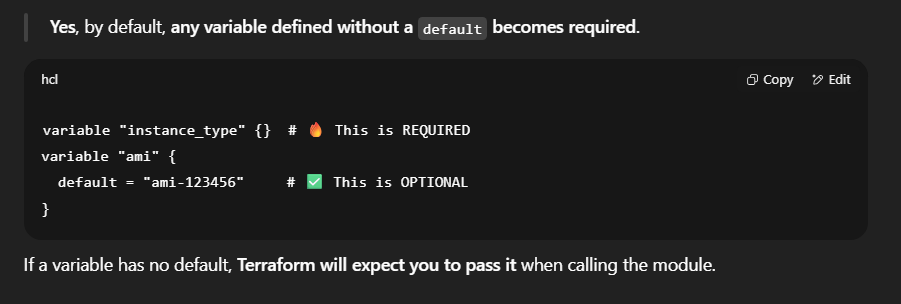

✅ Challenge 1: Basic EC2 App Deployment (Start Small)
🎯 Goal:
Provision an EC2 instance in a public subnet, install a simple web application, and expose it to the internet.

📦 Requirements:
VPC Setup

Create a VPC (CIDR: 10.0.0.0/16)

    One public subnet (CIDR: 10.0.1.0/24)

    Internet Gateway + Route Table for internet access

Security Group

    Allow:

    SSH (port 22) only from your IP

    HTTP (port 80) from anywhere

EC2 Instance

    Amazon Linux 2023 or Ubuntu

    Install NGINX (via user_data)

    Output the public IP

    Tag resources meaningfully

    Key Pair

    Create or use an existing key pair (don't commit private key!)

    Outputs

    Public IP of EC2

    VPC ID and Subnet ID

    ` terraform plan -var-file="prod.tfvars" `

